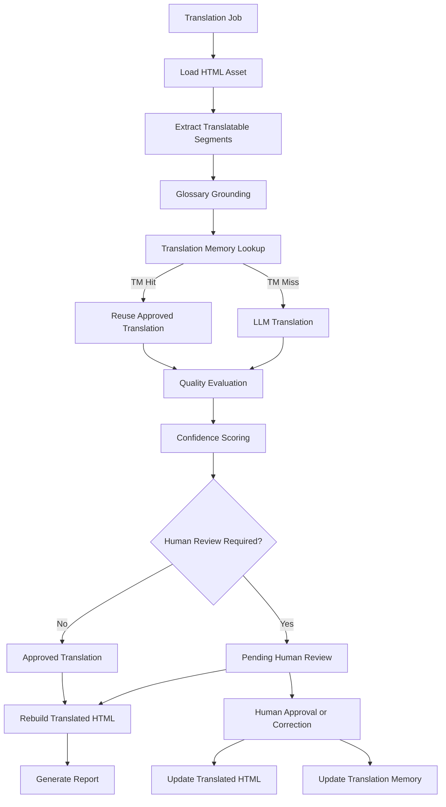

# Marketing Asset Translation Engine

An intelligent translation engine for marketing assets that combines LLM-powered translation, glossary grounding, Translation Memory, automated quality evaluation, and human-in-the-loop review to deliver consistent, high-quality translations while preserving the original content structure.


## Overview

The Marketing Asset Translation Engine translates HTML-based marketing content while preserving the original document structure and approved terminology.

The system first grounds each translatable segment using an approved glossary and Translation Memory (TM). Human-approved TM matches are reused directly, while unmatched segments are translated using an LLM. Translations are then evaluated for quality, assigned a confidence score, and routed for human review when required.

Human-approved corrections are applied to the translated HTML and stored in Translation Memory, enabling future translation jobs to reuse validated translations while reducing unnecessary LLM calls.


## Key Features

- **LLM-Powered Translation** – Translates marketing content using context-aware language models with structured, validated outputs.
- **Glossary Grounding** – Applies approved terminology and Do-Not-Translate (DNT) rules to maintain brand and terminology consistency.
- **Translation Memory (TM)** – Reuses human-approved translations through exact matching, reducing redundant LLM calls and improving consistency.
- **Automated Quality Evaluation** – Evaluates translations across accuracy, brand tone, glossary adherence, and formatting to generate a confidence score.
- **Human-in-the-Loop Review** – Automatically routes low-confidence translations for human review and incorporates approved corrections into the final asset.
- **Continuous Translation Memory Enrichment** – Stores human-approved corrections in Translation Memory for reuse in future translation jobs.
- **Structure-Preserving HTML Processing** – Extracts and translates relevant content while preserving the original HTML structure and formatting.
- **Job Caching & Reporting** – Avoids reprocessing completed jobs and generates execution reports with translation, TM usage, confidence, and review metrics.


## Architecture & Workflow

The engine follows a modular translation pipeline that prioritizes reusable human-approved translations before invoking the LLM and routes uncertain translations for human review.




## Demo

The following demo shows the `/translate` API executing an end-to-end translation job through the FastAPI interface.

[▶️ Watch Translation API Demo](docs/assets/translate-api-demo.mp4)


## AI Engineering Highlights

The system incorporates modern GenAI and agentic AI engineering patterns to build a controlled and production-oriented translation workflow:

- **AI Agents** – Specialized agents separate translation and quality evaluation responsibilities.
- **Agentic Workflow Orchestration** – LangGraph manages stateful workflow execution and conditional routing between translation, quality evaluation, and review stages.
- **Human-in-the-Loop (HITL)** – Low-confidence translations are routed to human reviewers, with approved corrections propagated back into the system.
- **Quality Gates** – Automated quality evaluation and confidence scoring determine whether translated content can proceed or requires human review.
- **LLM Guardrails** – Glossary grounding, Do-Not-Translate rules, structured outputs, and schema validation constrain LLM behavior and improve translation consistency.
- **Grounded Generation** – Translation prompts are enriched with approved terminology and contextual constraints before LLM invocation.
- **Structured LLM Outputs** – Pydantic schemas enforce predictable, validated outputs from LLM-powered components.
- **Translation Memory (TM)** – Human-approved translations are reused before invoking the LLM, improving consistency and reducing redundant inference.
- **Caching** – Completed translation jobs are reused to avoid unnecessary workflow execution and repeated LLM calls.
- **Confidence-Based Routing** – Quality signals are converted into confidence scores that drive automated workflow decisions.


## Project Structure

```text
marketing-asset-translation-engine/
├── app/
│   ├── agents/              # LLM-powered translation and quality evaluation agents
│   ├── api/                 # FastAPI routes and API models
│   ├── graph/               # LangGraph translation and review workflows
│   ├── models/              # Pydantic domain models and workflow state
│   ├── orchestrator/        # End-to-end translation workflow orchestration
│   ├── processors/          # HTML, glossary, and Translation Memory processing
│   ├── prompts/             # LLM prompt templates
│   ├── services/            # Human review business logic
│   ├── utils/               # Shared utilities and logging configuration
│   ├── config.py            # Application, path, and LLM configuration
│   └── main.py              # FastAPI application entry point
│
├── data/
│   ├── assets/              # Source HTML marketing assets
│   ├── glossary/            # Approved terminology and DNT rules
│   ├── translation_jobs/    # Translation job configuration files
│   ├── translation_memory/  # Human-approved reusable translations
│   └── outputs/             # Translated assets, reports, and review data
│
├── logs/                    # Application runtime logs
├── .env.example             # Environment configuration template
├── .gitignore               # Git exclusion rules
├── requirements.txt         # Python dependencies
└── README.md                # Project documentation
```

## Getting Started

### Prerequisites

- Python 3.10+
- pip
- Google Gemini API key

### Installation

1. Clone the repository:

```bash
git clone https://github.com/rohit19105/marketing-asset-translation-engine
cd marketing-asset-translation-engine
```

2. Create and activate a virtual environment:

```bash
python -m venv venv
```

**Windows:**

```bash
venv\Scripts\activate
```

**macOS / Linux:**

```bash
source venv/bin/activate
```

3. Install dependencies:

```bash
pip install -r requirements.txt
```

### Environment Configuration

Create a `.env` file in the project root using `.env.example` as a template:

```env
LLM_PROVIDER=gemini
LLM_MODEL=gemini-2.5-flash
GOOGLE_API_KEY=your_api_key_here
```

> Never commit API keys or other secrets to the repository.

### Run the Application

From the `app` directory:

```bash
cd app
uvicorn main:app --reload
```

The API will be available at:

`http://127.0.0.1:8000`

Interactive API documentation (Swagger UI):

`http://127.0.0.1:8000/docs`


## API Endpoints

| Method | Endpoint | Description |
|---|---|---|
| `GET` | `/health` | Checks whether the API is running |
| `POST` | `/translate` | Executes a translation job |
| `GET` | `/reviews/{job_id}` | Retrieves segments pending for human review |
| `POST` | `/reviews/{job_id}/{segment_id}` | Submits a human-approved translation for a segment |

### Run a Translation Job

```http
POST /translate
Content-Type: application/json
```

```json
{
  "job_file": "JOB-001.json"
}
```

A successful request returns the generated output URL along with the translation report.

### Human Review

Retrieve segments requiring review:

```http
GET /reviews/JOB-001
```

Submit an approved or corrected translation:

```http
POST /reviews/JOB-001/segment-1
Content-Type: application/json
```

```json
{
  "approved_translation": "Human-approved translated text"
}
```

Human-approved corrections are applied to the translated asset and added to Translation Memory for future reuse.

> Full interactive API documentation is available through Swagger UI at `/docs` while the application is running.


## Outputs

Each completed translation job generates its artifacts under:

```text
data/outputs/{job_id}/
```

Depending on the workflow outcome, the following files are generated:

| File | Description |
|---|---|
| `translated.html` | Translated marketing asset with the original HTML structure preserved |
| `report.json` | Job-level translation report containing TM usage, AI translation, confidence, and human-review metrics |
| `reviews.json` | Segments requiring human review; generated only when one or more segments are routed for review |

Human-approved corrections update the translated HTML and are added to Translation Memory for reuse in future translation jobs.

## Technology Stack

| Technology | Purpose |
|---|---|
| Python | Core application development |
| FastAPI | REST API layer |
| LangChain | LLM integration and structured AI workflows |
| LangGraph | Translation and human-review workflow orchestration |
| Google Gemini | LLM-powered translation and quality evaluation |
| Pydantic | Data validation and structured LLM outputs |
| Beautiful Soup | HTML parsing and reconstruction |
| OpenPyXL | Glossary ingestion from Excel |


## Future Enhancements

The current architecture provides a foundation for extending the translation workflow with additional quality, retrieval, and scalability capabilities:

- **Deterministic Quality Assurance** – Add rule-based validation for Do-Not-Translate (DNT) terms, glossary adherence, placeholder preservation, and formatting consistency alongside LLM-based quality evaluation.

- **Semantic Translation Memory** – Extend exact-match Translation Memory with embedding-based semantic similarity to identify and reuse relevant previously approved translations.

- **Multi-Format Asset Support** – Extend the processing layer beyond HTML to support additional marketing asset formats such as Markdown, JSON, and document-based content.

- **Batch & Parallel Processing** – Support concurrent processing of multiple translation jobs and segments for improved throughput at scale.

- **LLM Observability & Evaluation** – Introduce tracing, token/cost monitoring, latency metrics, and evaluation dashboards for deeper visibility into LLM and agent behavior.

- **Persistent Storage** – Replace file-based Translation Memory, review state, and job metadata with a database-backed persistence layer for production-scale deployments.

- **Web-Based User Interface** – Build a frontend for submitting translation jobs, previewing translated assets, monitoring job status, reviewing flagged segments, and approving or editing translations through an interactive human-review interface.